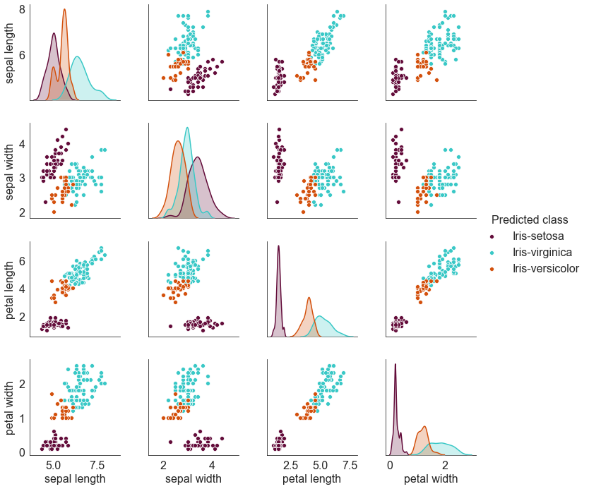

**Step 1 :**
Collect any dataset without decision attribute. The dataset may be collected from UCI machine
learning repository.

`wget http://archive.ics.uci.edu/ml/machine-learning-databases/iris/iris.data`

**Step 2 :**
Let the dataset has m rows and n columns where, each row is an object and each column is an
attribute or feature of the object in the dataset. So you can consider the dataset as an m\*n matrix.

**Step 3 :**
Normalize the attribute values within the range [0,1] using any normalization technique to give all
the attributes an equal importance.

**Step 4 :**
Create a dissimilarity matrixSof size m\*m where, each (i, j)-th entry in the matrix gives the
dissimilarity measurement between i-th and j-th objects. Use Euclidean distance to measure the
dissimilarity.

**Step 5 :**
The i-th row indicates similarity of i-th object with all other objects. Find the average dissimilarity
of i-th object with other objects and form a cluster Ci with i-th object and objects having dissimilarity
less than the average similarity. Repeat this process for all rows of the similarity matrix. Thus, you
have now m clusters.

**Step 6 :**
Remove the clusters (if any) which are subset of some other clusters. As a result you have now say,
p (<m) clusters.

**Step 7 :**
Create a similarity matrix C of size p\*p where, each (i, j)-th entry in the matrix gives the similarity
measurement between i-th cluster Ci and j-th cluster Cj using following similarity measure.
Cij =|Ci ∩ Cj|/|Ci ∪ Cj|

**Step 8 :**
Out of all p\*p entries in matrix C, find out the maximum value. If multiple maximum values occur,
choose any one randomly. Let, Ckl is the maximum value selected, that implies clusters Ck and Cl are
the most similar clusters among all p clusters. Merge these two clusters Ck and Cl to get a new cluster
Ckl, i.e. Ckl = Ck U Cl.

**Step 9 :**
Repeat steps 6 to 8 until desire number (say, at most K) of clusters are obtained.

**Step 10 :**
You will get overlapping clusters. Next find the probability of an object to be in all the
clusters. For this, you may compute the similarity of it to the mean of the cluster in which it lies. Set
similarity of it to a cluster, in which it does not lie, as zero. Also put the object into a single cluster to
which the similarity is maximum. Break the tie arbitrarily.

The solution in plot.ipynb does the analysis in two parts. First it considers k=3, then it considers k=2.
Both of these when analyzed using pair-plots, clearly reveal that Iris-setosa is linearly separable
from the other 2 classes. Iris-versicolour and Iris-virginica display a strong degree of correlation to the
extent that some of the members of Iris-versicolor are misclassified by the algorithm developed as belonging
to the Iris-virginica class.

## For k = 3, the pair-plots using the original dataset is

  

## The pair-plots using the clustering algorithm developed is

  

## For side-by-side comparison of the two images above,

  

## For k = 2, the pair-plots using the original dataset is

  

## The pair-plots using the clustering algorithm developed is

  

## For side-by-side comparison of the two images above,

  

