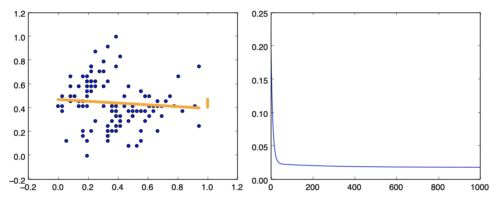
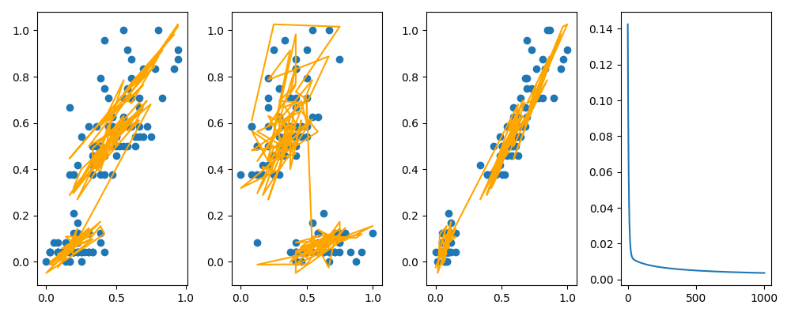

# Assignment 2

## Anjishnu Mukherjee B05-511017020 (510517086)

## February 2020

### Part 1 : Regression

---
1a. **Simple Linear Regression**

    The graph on the left shows the linear equation learnt by the model in orange.
    The graph on the right shows the decrease of loss function across epochs during the training process.

<p align="center">
  

---
1b. **Multi-variable Regression**

    The graph on the extreme right represents progress of loss across epochs.
    The y-axis of all the other 3 graphs corresponds to petal width in cm (treated as Y variable for regression). The X-axes on each of these corresponds to sepal length in cm, sepal width in cm and petal length in cm respectively from left to right.

    I have done the regression task with
    X -> sepal length in cm, sepal width in cm , petal length in cm
    Y -> petal width in cm
    To be able to plot the graph in 2D, we choose the axes convention described.

    It is quite apparent that the variables are not linearly regressible.

<p align="center">
  

---

### Part 2 : Discretisation

```

For all the graphs in this section, 
X axis represents the values of sepal length in cm plotted as bin boundaries 
Y axis represents the number of items stored in each bin.

```

---

- **I plot the original data to see the data distribution into buckets initially.** <br>

    Clearly it is not a uni-modal distribution.

<p align="center">
  

---

- **Graph of Equal Width based Binning.**

<p align="center">
  

---

- **Graph of Equal Frequency based Binning**

<p align="center">
  

---

- **Graph of K-Means clustering based binning**

<p align="center">
  

---

- **Graph of binning using the method developed in the first assignment**

<p align="center">
  

---

- **Graph of Entropy based Binning**

<p align="center">
  

---

- **Graph of Natural Segmentation based Binning**

<p align="center">
  
