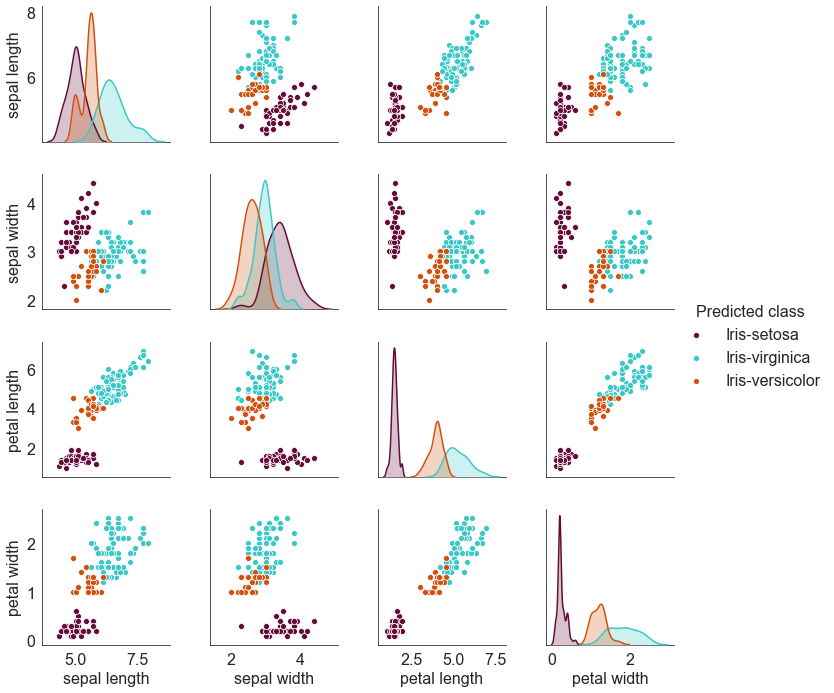
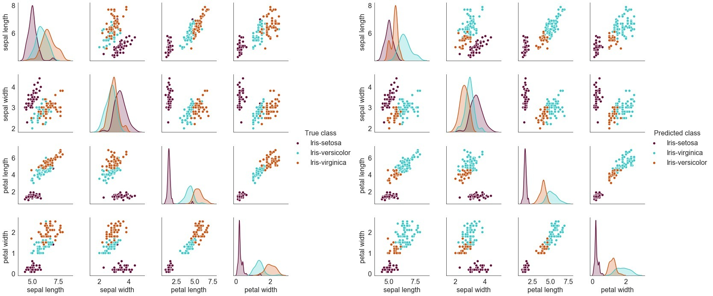
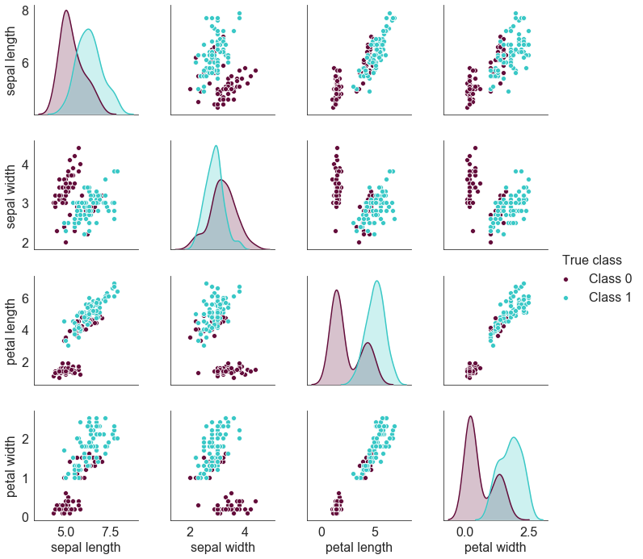
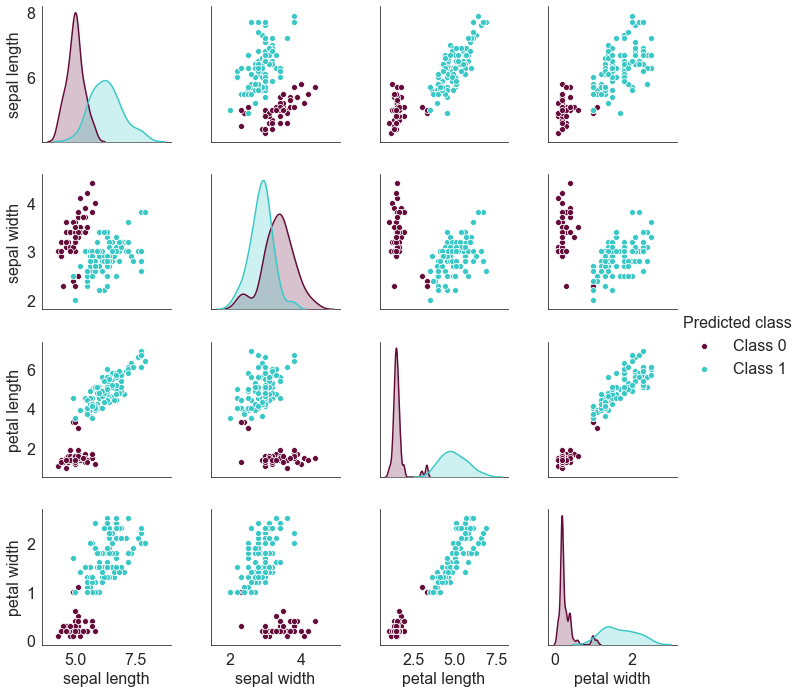
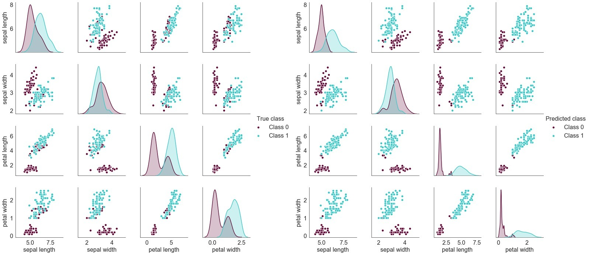

An HTML file corresponding to the complete solution is being submitted separately.
The solution does the analysis in two parts. First it considers k=3, then it considers k=2.
Both of these when analyzed using pair-plots, clearly reveal that Iris-setosa is linearly separable
from the other 2 classes. Iris-versicolour and Iris-virginica display a strong degree of correlation to the
extent that some of the members of Iris-versicolor are misclassified by the algorithm developed as belonging
to the Iris-virginica class.

## For k = 3, the pair-plots using the original dataset is

  

## The pair-plots using the clustering algorithm developed is

  

## For side-by-side comparison of the two images above,

  

## For k = 2, the pair-plots using the original dataset is

  

## The pair-plots using the clustering algorithm developed is

  

## For side-by-side comparison of the two images above,

  

