# Assignment 4

## Anjishnu Mukherjee B05-511017020 (510517086)

## May 2020

### Datasets Used

- [Iris Dataset](https://archive.ics.uci.edu/ml/datasets/iris)
- [Wine Dataset](https://archive.ics.uci.edu/ml/datasets/wine)
- [Seeds Dataset](https://archive.ics.uci.edu/ml/datasets/seeds)
- [Breast Cancer Wisconsin Dataset](https://www.kaggle.com/uciml/breast-cancer-wisconsin-data)
- [Haberman's Survival Dataset](https://archive.ics.uci.edu/ml/datasets/Haberman's+Survival)
- [Pima Indian Diabetes Dataset](https://archive.ics.uci.edu/ml/support/diabetes)
- [BankNote Authentication Dataset](https://archive.ics.uci.edu/ml/datasets/banknote+authentication)

All the datasets are taken from the well-known UCI Machine Learning repository.

### Task 1 - Cluster Analysis

DBSCAN and Infomap don't work too well with the Seeds Dataset and thus we use
the Wine Dataset in its place for those 2 algorithms. The Iris Dataset and the
Breast Cancer Wisconsin Dataset has been used for all clustering algorithms.

#### K-Means Algorithm

- **Iris Dataset**

  Cluster 1 -> Length = 50  
  Cluster 2 -> Length = 53  
  Cluster 3 -> Length = 47  

  Cluster validation Indices (rounded to 4 decimal places):  
  Silhouette Index = 0.5059  
  Davies Bouldin Index = 0.8354  
  Dunne Index = 0.5303  

- **Breast Cancer Wisconsin Dataset**

  Cluster 1 -> Length = 230  
  Cluster 2 -> Length = 453  

  Cluster validation Indices (rounded to 4 decimal places):  
  Silhouette Index = 0.5939  
  Davies Bouldin Index = 0.8200  
  Dunne Index = 0.6417  

- **Seeds Dataset**

  Cluster 1 -> Length = 67  
  Cluster 2 -> Length = 71  
  Cluster 3 -> Length = 72  

  Cluster validation Indices (rounded to 4 decimal places):  
  Silhouette Index = 0.4506  
  Davies Bouldin Index = 0.9279  
  Dunne Index = 0.5000  

#### DBSCAN Algorithm

Graph for determining optimum epsilon value using grid search.

  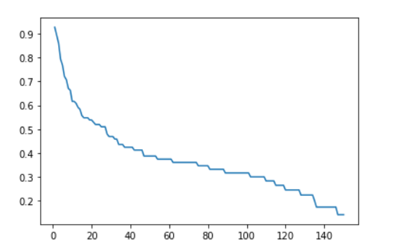

- **Iris Dataset**

  Cluster 1 -> Length = 5  
  Cluster 2 -> Length = 50  
  Cluster 3 -> Length = 95  

  Cluster validation Indices (rounded to 4 decimal places):  
  Silhouette Index = 0.5336  
  Davies Bouldin Index = 0.5262  
  Dunne Index = 0.5813  

- **Breast Cancer Wisconsin Dataset**

  Cluster 1 -> Length = 183  
  Cluster 2 -> Length = 35  
  Cluster 3 -> Length = 351  

  Cluster validation Indices (rounded to 4 decimal places):  
  Silhouette Index = 0.2712  
  Davies Bouldin Index = 2.5451  
  Dunne Index = 0.0556  

- **Wine Dataset**

  Cluster 1 -> Length = 23  
  Cluster 2 -> Length = 104  
  Cluster 3 -> Length = 51  

  Cluster validation Indices (rounded to 4 decimal places):  
  Silhouette Index = - 0.0554  
  Davies Bouldin Index = 3.0640  
  Dunne Index = 0.0148  

#### Infomap Algorithm

Infomap is a graph-based clustering algorithm where each data point can be
treated as a node with edges connecting pairs of them. The weight of an edge
corresponds to the euclidean distance between them.

For the implementation, an average value of edge weights is determined and
all edges with weights less than that are dropped. The final set of edges
(in a .gml file) is given as input to ​igraph’s community_infomap.​

- **Iris Dataset**

  Cluster 1 -> Length = 52  
  Cluster 2 -> Length = 97  
  Cluster 3 -> Length = 1  

  Cluster validation Indices (rounded to 4 decimal places):
  Silhouette Index = 0.4218  
  Davies Bouldin Index = 0.4220  
  Dunne Index = 0.4664  

- **Breast Cancer Wisconsin Dataset**

  Cluster 1 -> Length = 460  
  Cluster 2 -> Length = 216  
  Cluster 3 -> Length = 6  
  Cluster 4 -> Length = 1  

  Cluster validation Indices (rounded to 4 decimal places):  
  Silhouette Index = 0.3982  
  Davies Bouldin Index = 1.0675  
  Dunne Index = 0.4026  

- **Wine Dataset**

  Cluster 1 -> Length = 47  
  Cluster 2 -> Length = 131  

  Cluster validation Indices (rounded to 4 decimal places):  
  Silhouette Index = 0.6572  
  Davies Bouldin Index = 0.4565  
  Dunne Index = 0.8579  

#### Clustering Algorithm developed in Assignment-1

- **Iris Dataset**

  Cluster 1 -> Length = 86  
  Cluster 2 -> Length = 50  
  Cluster 3 -> Length = 14  

  Cluster validation Indices (rounded to 4 decimal places):  
  Silhouette Index = 0.0309  
  Davies Bouldin Index = 2.2610  
  Dunne Index = 0.1293  

- **Breast Cancer Wisconsin Dataset**

  Only the first 200 data points are used to reduce the extensive computation
  time needed by this algorithm.

  Cluster 1 -> Length = 135  
  Cluster 2 -> Length = 63  

  Cluster validation Indices (rounded to 4 decimal places):  
  Silhouette Index = 0.4415  
  Davies Bouldin Index = 1.0738  
  Dunne Index = 0.4662  

- **Seeds Dataset**

  Cluster 1 -> Length = 39  
  Cluster 2 -> Length = 58  
  Cluster 3 -> Length = 113  

  Cluster validation Indices (rounded to 4 decimal places):  
  Silhouette Index = 0.3599  
  Davies Bouldin Index = 1.1377  
  Dunne Index = 0.3642  

### Task-2 : Classification Analysis

10 fold cross validation is done for all cases. The intermediate results are not
presented here for brevity, only the final results are given for each case.

#### Decision Tree

- **BankNote Authentication Dataset**

  Accuracy:  0.982497619803237  
  Specificity:  0.9828352222510384  
  Sensitivity:  0.9820866935483871  
  Precision:  0.9789299717514691  
  F-measure:  0.9803762035555337  
  Prediction:  760   612  
  Actual Class label:  762   610  

  

    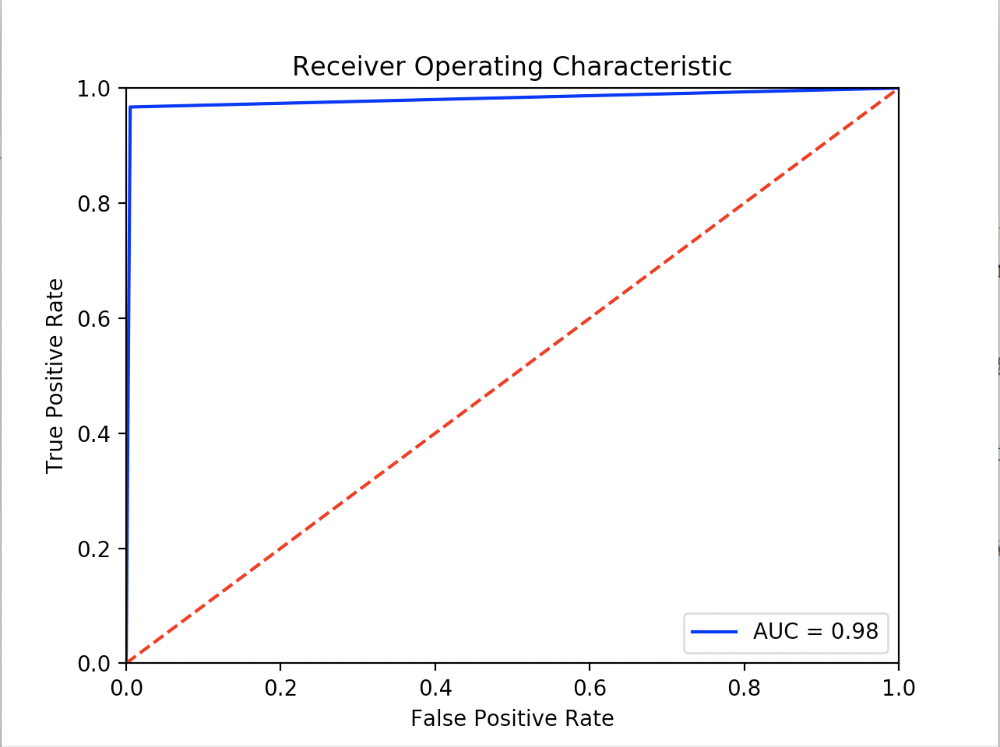

- **Breast Cancer Wisconsin Dataset**

  Accuracy:  0.9501705029838023  
  Specificity:  0.9614337520630845  
  Sensitivity:  0.930331616853356  
  Precision:  0.9305259595476987  
  F-measure:  0.9290235519235841  
  Prediction:  444   239  
  Actual Class label:  444   239  

  

    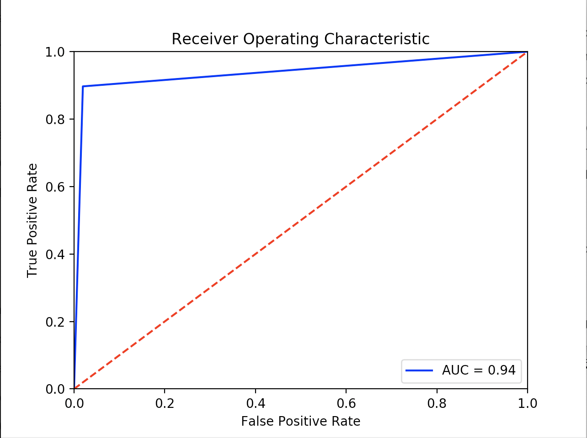

- **Haberman's Survival Dataset**

  Accuracy:  0.666236559139785  
  Specificity:  0.7749470217044588  
  Sensitivity:  0.4202633477633477  
  Precision:  0.37238095238095237  
  F-measure:  0.3753861369109047  
  Prediction:  225   81  
  Actual Class label:  225   81  

  

    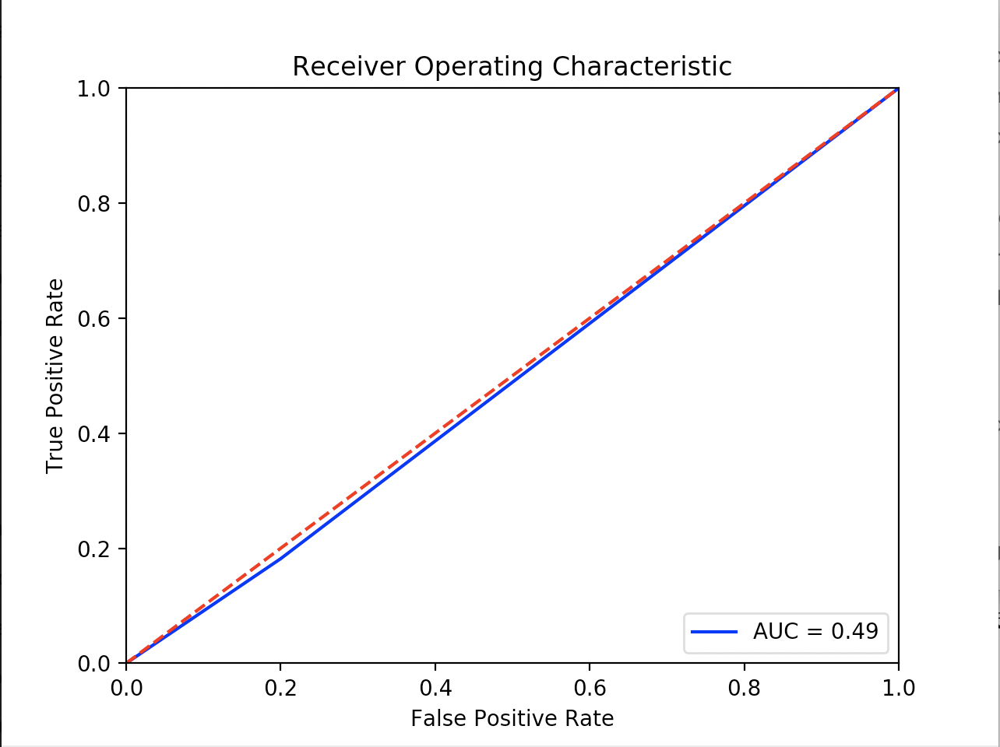

- **Pima Indian Diabetes Dataset**

  Accuracy:  0.7031100478468899  
  Specificity:  0.7805294970986459  
  Sensitivity:  0.5661191805715133  
  Precision:  0.5792382641253608  
  F-measure:  0.5662043283931991  
  Prediction:  508   260  
  Actual Class label:  500   268  

  

    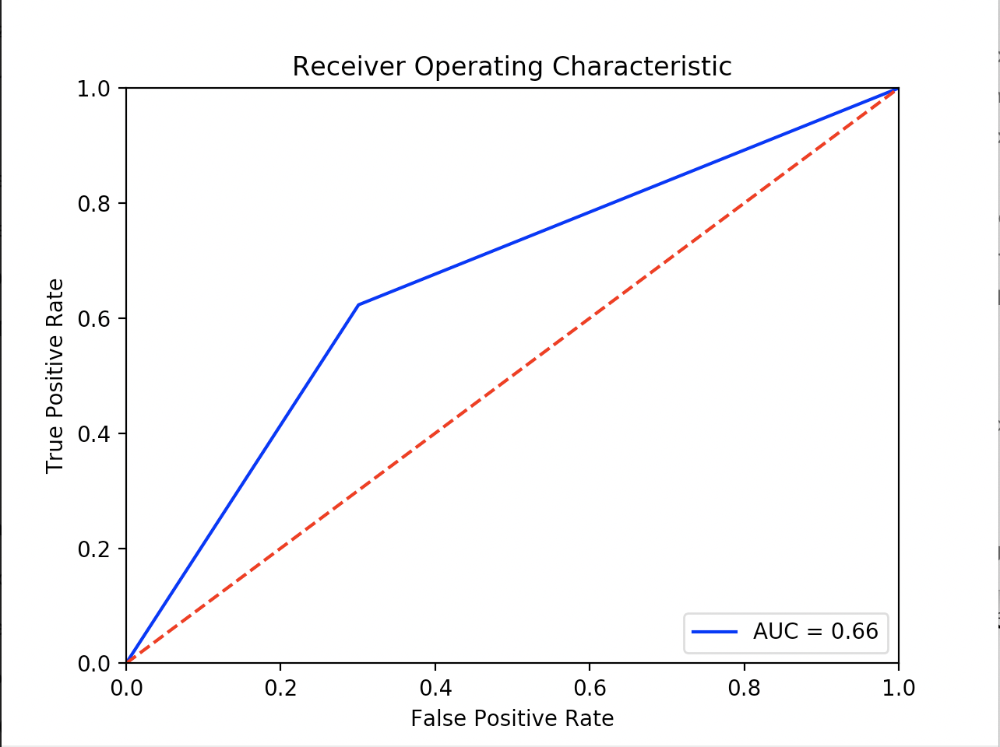

#### Naïve Bayes

- **BankNote Authentication Dataset**

  Accuracy:  0.8389664656722733  
  Specificity:  0.8787525628364371  
  Sensitivity:  0.7926724168785175  
  Precision:  0.8386117247270881  
  F-measure:  0.8132050044960154  
  Prediction:  797   575  
  Actual Class label:  762   610  

  

    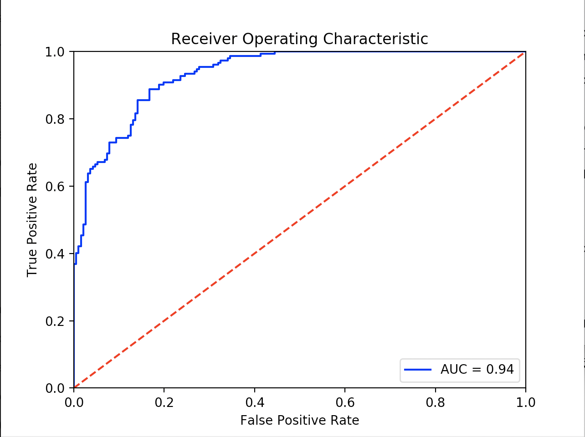

- **Breast Cancer Wisconsin Dataset**

  Accuracy:  0.9633205456095482  
  Specificity:  0.9558769143796896  
  Sensitivity:  0.9802900137232973  
  Precision:  0.9233205240813935  
  F-measure:  0.9488355568988098  
  Prediction:  429   254  
  Actual Class label:  444   239  

  

    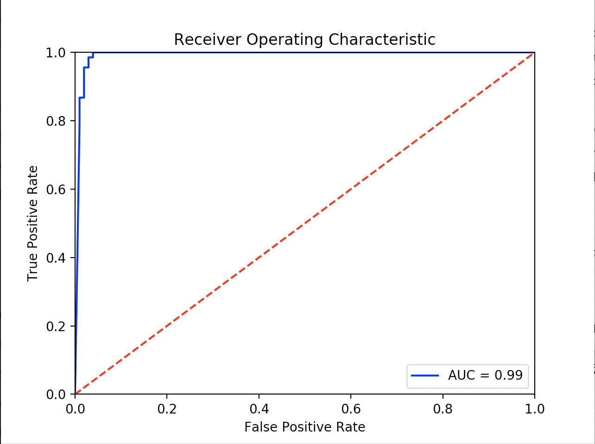

- **Haberman's Survival Dataset**

  Accuracy:  0.7450537634408602  
  Specificity:  0.9385720873329569  
  Sensitivity:  0.211019536019536  
  Precision:  0.5511904761904762  
  F-measure:  0.28564102564102567  
  Prediction:  275   31  
  Actual Class label:  225   81  

  

    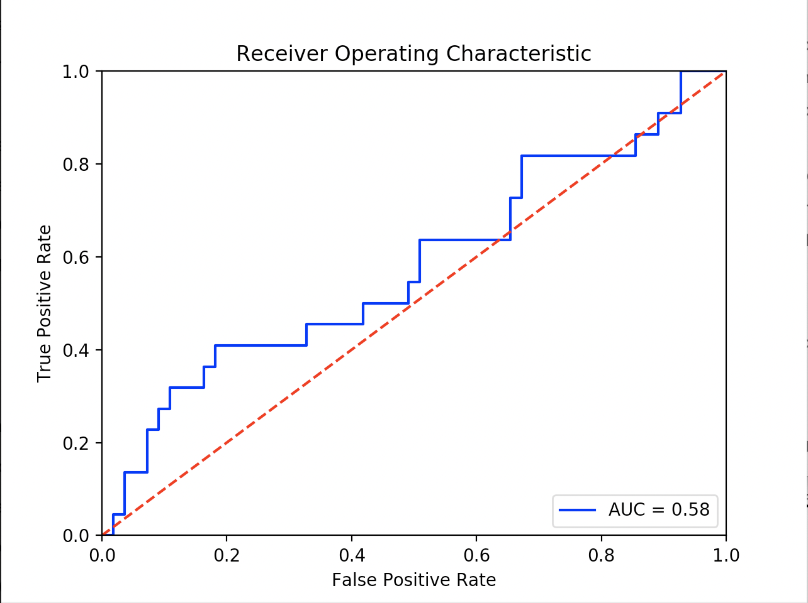

- **Pima Indian Diabetes Dataset**

  Accuracy:  0.7592105263157896  
  Specificity:  0.8425872995663299  
  Sensitivity:  0.6082767775518201  
  Precision:  0.6692941963084392  
  F-measure:  0.6330167235470293  
  Prediction:  527   241  
  Actual Class label:  500   268  

  

    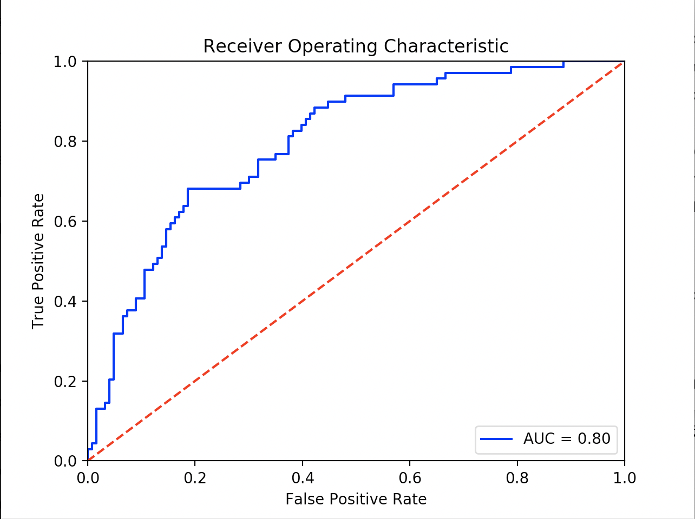

#### KNN

- **BankNote Authentication Dataset**

  Accuracy:  0.9956310166084841  
  Specificity:  0.9921013090555345  
  Sensitivity:  1.0  
  Precision:  0.9904764638346727  
  F-measure:  0.9951569442389516  
  Prediction:  756   616  
  Actual Class label:  762   610  

  

    

- **Breast Cancer Wisconsin Dataset**

  Accuracy:  0.9663682864450127  
  Specificity:  0.9748283800563758  
  Sensitivity:  0.9536729797979799  
  Precision:  0.956188961900169  
  F-measure:  0.9538943469414246  
  Prediction:  445   238  
  Actual Class label:  444   239  

  

    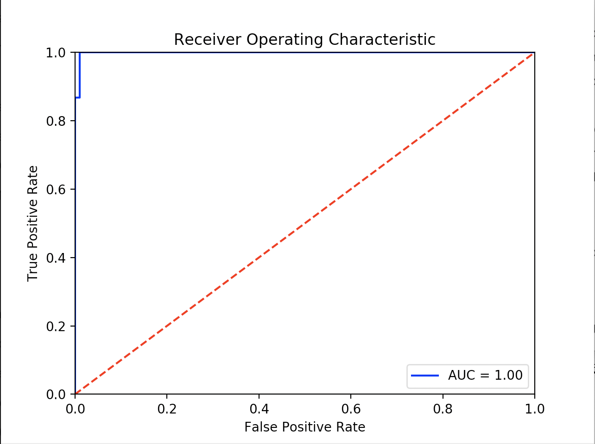

- **Haberman's Survival Dataset**

  Accuracy:  0.725268817204301  
  Specificity:  0.9324858886346302  
  Sensitivity:  0.16428571428571428  
  Precision:  0.44000000000000006  
  F-measure:  0.22576923076923078  
  Prediction:  279   27  
  Actual Class label:  225   81  

  

    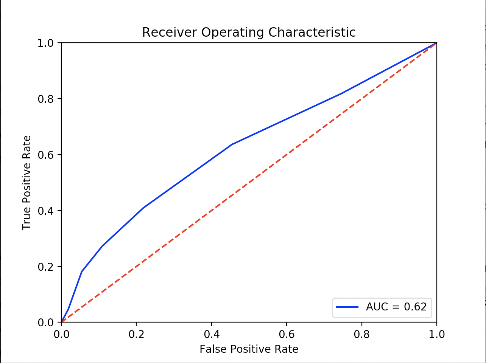

- **Pima Indian Diabetes Dataset**

  Accuracy:  0.7345181134654819  
  Specificity:  0.8537733948309499  
  Sensitivity:  0.505056462056462  
  Precision:  0.654110233778426  
  F-measure:  0.5661286781167465  
  Prediction:  560   208  
  Actual Class label:  500   268  

  

    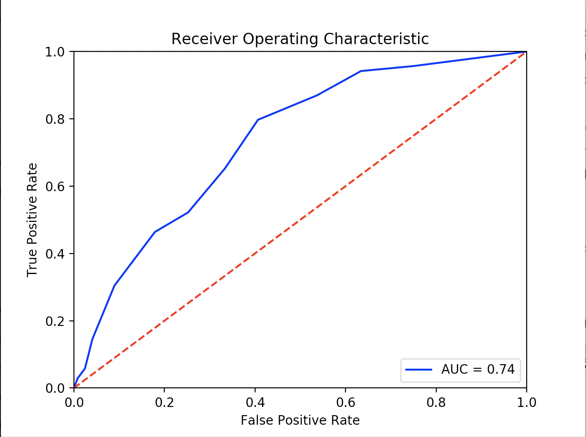

#### SVM

- **BankNote Authentication Dataset**

  Accuracy:  1.0  
  Specificity:  1.0  
  Sensitivity:  1.0  
  Precision:  1.0  
  F-measure:  1.0  
  Prediction:  762   610  
  Actual Class label:  762   610  

  

    

- **Breast Cancer Wisconsin Dataset**

  Accuracy:  0.9706947996589939  
  Specificity:  0.9674638205531718  
  Sensitivity:  0.9758705647176411  
  Precision:  0.94581223893066  
  F-measure:  0.9598474346492758  
  Prediction:  436   247  
  Actual Class label:  444   239  

  

    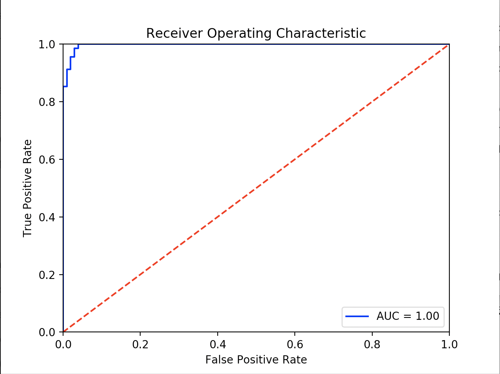

- **Haberman's Survival Dataset**

  Accuracy:  0.738279569892473  
  Specificity:  0.9280952380952382  
  Sensitivity:  0.21119047619047623  
  Precision:  0.5516666666666665  
  F-measure:  0.293005883005883  
  Prediction:  273   33  
  Actual Class label:  225   81  

  

    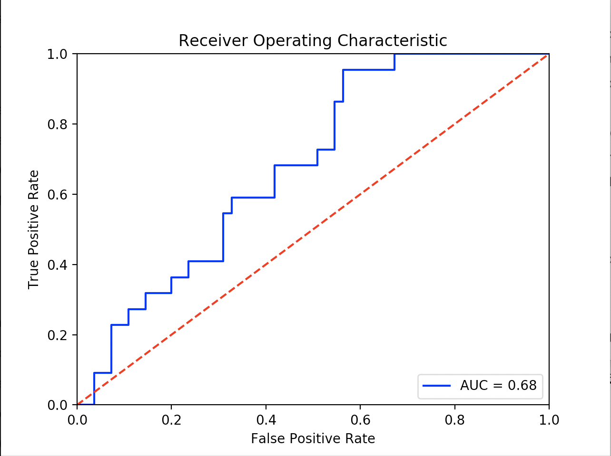

- **Pima Indian Diabetes Dataset**

  Accuracy:  0.7578092959671907  
  Specificity:  0.8717053464237511  
  Sensitivity:  0.5382652975089014  
  Precision:  0.6884103608868742  
  F-measure:  0.6008505361904428  
  Prediction:  558   210  
  Actual Class label:  500   268  

  

    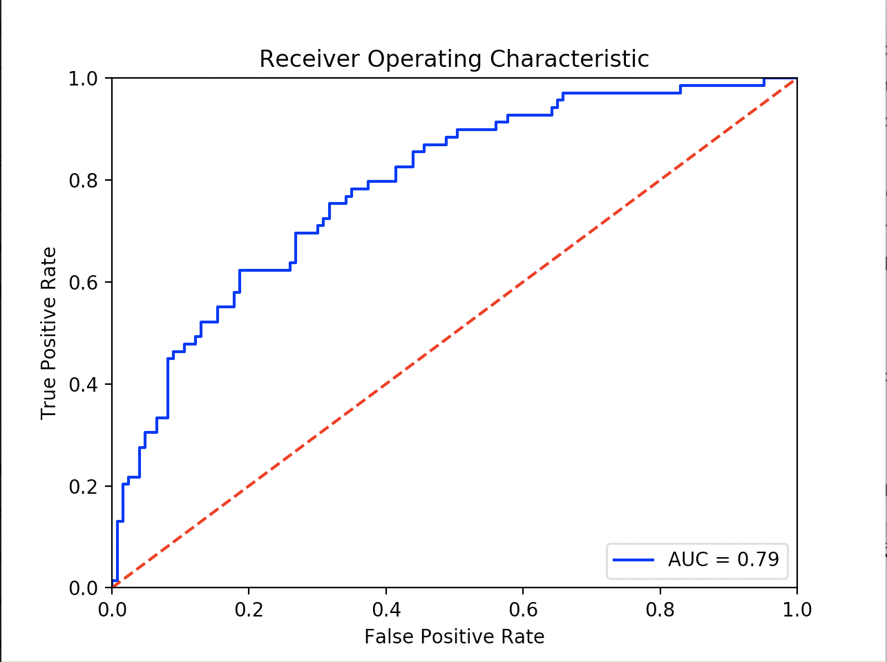

#### Bagging

- **BankNote Authentication Dataset**

  Accuracy:  0.9890722521950703  
  Specificity:  0.9896917509541462  
  Sensitivity:  0.9877610134963074  
  Precision:  0.9864901343593644  
  F-measure:  0.9870368301341568  
  Prediction:  761   611  
  Actual Class label:  762   610  

  

    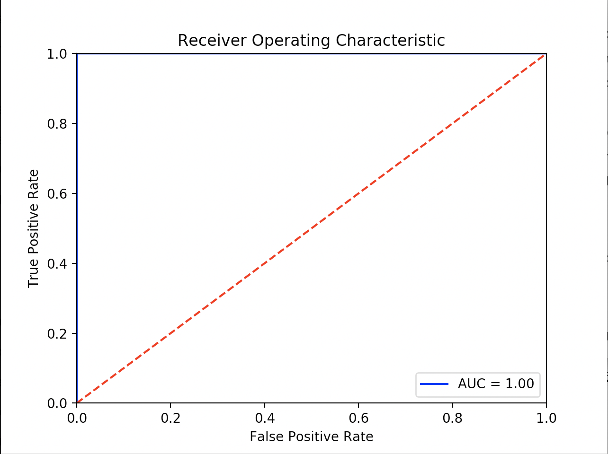

- **Breast Cancer Wisconsin Dataset**

  Accuracy:  0.954688832054561  
  Specificity:  0.9653364376651545  
  Sensitivity:  0.9291794364314386  
  Precision:  0.9425795315795316  
  F-measure:  0.9340692263711133  
  Prediction:  445   238  
  Actual Class label:  444   239  

  

    

- **Haberman's Survival Dataset**

  Accuracy:  0.6762365591397849  
  Specificity:  0.8227567441084066  
  Sensitivity:  0.2894993894993895  
  Precision:  0.3866666666666666  
  F-measure:  0.30789904539904545  
  Prediction:  244   62  
  Actual Class label:  225   81  

  

    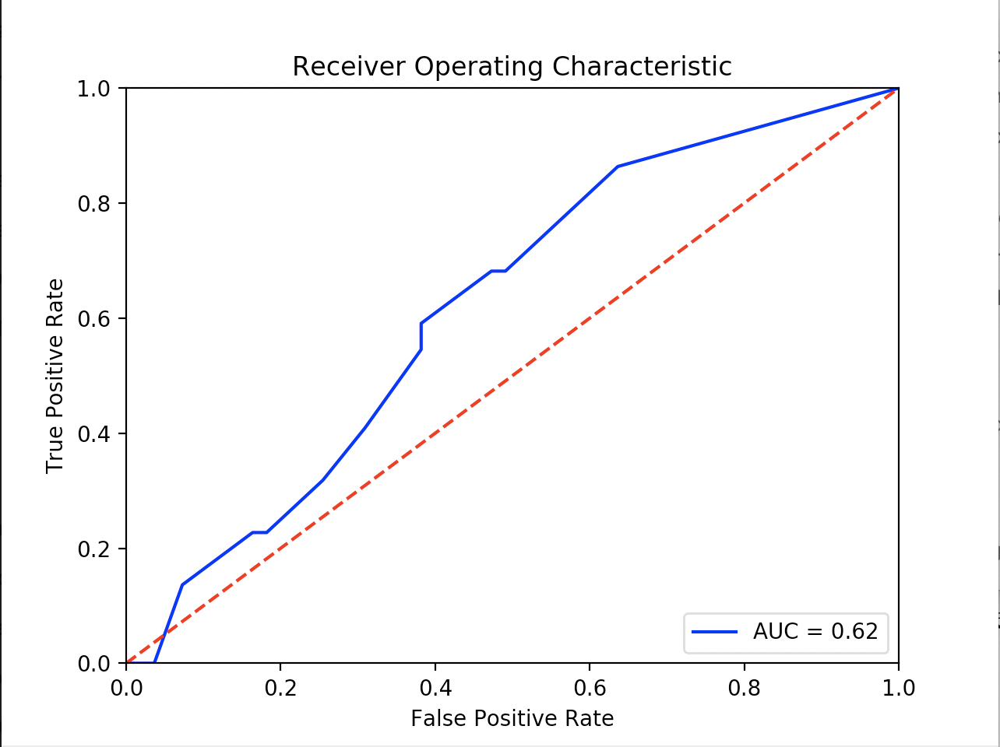

- **Pima Indian Diabetes Dataset**

  Accuracy:  0.7435577580314423  
  Specificity:  0.8529084524070729  
  Sensitivity:  0.5348681311816619  
  Precision:  0.6604950540602714  
  F-measure:  0.5862814191475204  
  Prediction:  549   219  
  Actual Class label:  500   268  

  

    

---

For each classifier, I have computed the following performance measure metrics
using 10-fold cross validation.

1. Accuracy
2. Specificity
3. Sensitivity
4. Precision
5. Recall
6. F-Measure

Also, I have included the number of samples predicted as belonging to each class
versus actually belonging to each class in the displayed output. And I have
drawn the ROC curves for each case as well.

Four different datasets have been used for testing each of the five classifiers.

1. BankNote Authentication Dataset
2. Breast Cancer Wisconsin Dataset
3. Haberman's Survival Dataset
4. Pima Indian Diabetes Dataset

---

On the basis of all the analysis performed, one general conclusion that I can
draw is that the BankNote Authentication Dataset and the Breast Cancer Wisconsin
Dataset seem relatively easily to classify or cluster because all algorithms
achieve nearly perfect results for these 2 cases. Whereas for the other
datasets, the algorithms only have average performance.

---
