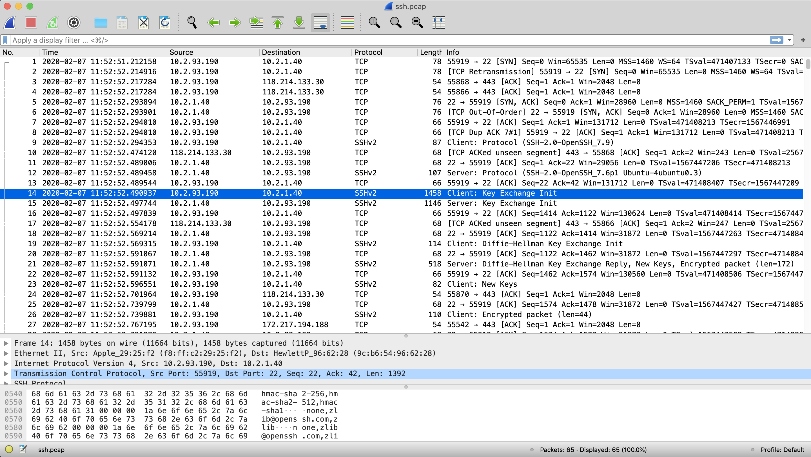

# Assignment 3

## Anjishnu Mukherjee B05-511017020 (510517086)

3a. Analyse the packets (across all layers) exchanged with your computer while executing the
    following commands: (i) ping, (ii) traceroute, (iii) dig, (iv) arp,(v) wget.

    (i) ping :

        - We capture the relevant packets using the icmp filter. 
        - There are 2 types of packets : Ping Request and Response
        - A request is made from my laptop's IP to the destination IP.
        - Corresponding response is present in the next packet.

  

    (ii) traceroute :

        - Makes use of TTL mechanism limiting the time to live for 
          each packet to some value.
        - Devices send back an ICMP message when dropping the packet.
        - Thus we filter using ICMP filter.
        - The protocol used for the probes in a UNIX system is UDP and responses 
          are send back using ICMP.

  

    (iii) dig :

        - We filter using dns protocol.
        - The info for the request packet shows 'A' because we are querying
          for a IP address.
        - The DNS response packet shows the IP address corresponding to the name 
          specified in the request.

  

    (iv) arp :

        - We filter using the ARP protocol.
        - 2 packets are captured - ARP request and ARP reply.
        - The request packet asks for the MAC address corresponding to the 
          IP address of en0.
        - en0 is the active promiscuous mode interface I am using in wireshark.
        - The reply packet gives the MAC address.

  

    (v) wget :

        - We filter using tcp.port == 80 ( I am trying to get a http page using wget.)
        - Many packets get captured, but only 2 are of interest. (GET/HTTP and HTTP OK)
        - GET corresponds to sending the request and OK is the response 
          on successful completion.

  

3b. Capture the packets while sending/receiving telnet request/response between your computer and a
    custom server running the telnet daemon. What is your observation while analysing the application layer data?

    - telnet 10.2.0.250 (Username/Password : test/test)
    - Packets between client and server are NOT encrypted using SSH 
      or any other protocols.
    - The only protocol being used is telnet which is not secured in any form.

  

3c. Capture the packets while sending/receiving ssh request/response
    between your computer and one of the department servers. What is your observation while
    analysing the application layer data?

    -  Packets exchanged between the client and server are encrypted using SSHv2 based on 
       OpenSSH 7.9
    -  The TLS protocol is used in the application layer.

  

3d. Enter the URL: <http://gaia.cs.umass.edu/wireshark-labs/INTRO-wireshark-file1.html> and capture packets using Wireshark.
    After your browser has displayed the INTRO-wireshark-file1.html page (it is a simple one line of congratulations), stop Wireshark packet capture. Answer the following from the packets captured:

    - We use http filter for Wireshark capture.

    (i) How long did it take from when the HTTP GET message was sent until 
        the HTTP OK reply was received?

        HTTP GET timestamp - Jan 31, 2020 18:10:56.451051000 IST
        HTTP OK timestamp  - Jan 31, 2020 18:10:56.860242000 IST
        Time delta - 0.409191000 seconds

  

    (ii) What is the Internet address of the gaia.cs.umass.edu?     
        What is the Internet address of your computer? 
        Support your answer with an appropriate screenshot from your computer.

        IP of gaia.cs.umass.edu : 128.119.245.12
        Verfied further using nslookup.
        ---
        (base) anjishnu@mymacpro ~ % nslookup 128.119.245.12
        ;; Got recursion not available from 89.207.131.21, trying next server
        Server:  8.8.8.8
        Address: 8.8.8.8#53

        Non-authoritative answer:
        12.245.119.128.in-addr.arpa name = gaia.cs.umass.edu.
        ---

  

        IP of active promiscuous mode interface of my machine is 192.168.1.4

        (Relevant screenshots attached with this document in submission email.)

  

3e. Start the Wireshark packet capturingservice. Enter the URL: <https://www.gmail.com> on your browser
    and sign-in to your gmail account by providing credentials (Username/Password).
    Answer the following from the captured packets:

  

    i. Is there any difference in the application layer protocol?
    
       This URL uses HTTPS whereas for the previous question the URL used HTTP.
       Thus GMail application data is encrypted whereas for the previous question, 
       we can directly see all the data captured from the packets as it was not secure.

    ii. How it is different from the HTTP data you analysed in the above problem?

       The application data is encrypted using TLS protocol version 1.3 in this case.
       Whereas for the previous question, there was no encryption involved.
