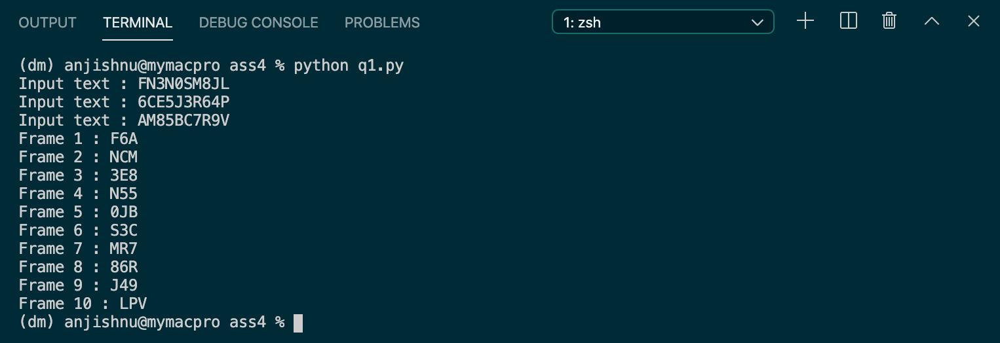
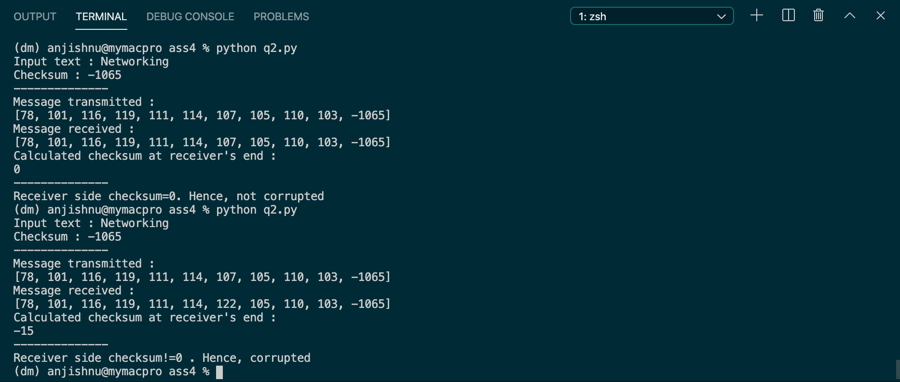

# Assignment 4

## Anjishnu Mukherjee B05-511017020 (510517086)

<b><u>4a.</u></b> 
<i>The aim of this programming assignment is to <b><u>simulate a rudimentary time division
    multiplexing mechanism</u></b>. Multiplexing STS-1 multiple data streams, called tributaries,
    plays an important role in SONET. A 3:1 multiplexer multiplex three input STS-1
    tributaries onto one output STS-3 stream. This multiplexing is done byte for byte. That
    is, the first three output bytes are the first bytes of tributaries 1, 2, and 3, respectively.
    The next three output bytes are the second bytes of tributaries 1, 2, and 3, respectively,
    and so on. Write a program that simulates this 3:1 multiplexer. Your program should
    consist of five processes. The main process creates four processes, one each for the
    three STS-1 tributaries and one for the multiplexer. Each tributary process reads in an
    STS-1 frame from an input file as a sequence of 100 bytes. They send their frames (byte
    by byte) to the multiplexer process. The multiplexer process receives these bytes and
    outputs an STS-3 frame (byte by byte) by writing it to standard output. Use pipes for
    communication STS and the multiplexer processes.</i>

    I have implemented the solution in Python using only in-built libraries
    for system calls and random number generation purposes. A sample output
    for a reduced number of input bytes to each source is given below.

  

<b><u>4b.</u></b> 
<i> The objective of this programming assignment is to <b><u>simulate the usage of checksum as
    an error detection technique in data transmission</u></b>. Suppose the payload portion of a
    packet contains 10 bytes consisting of the 8-bit unsigned binary ASCII representation
    of string “Networking.” Write a program to compute the Internet checksum for this
    data. Your program should have three functions. The first function reads the data from
    an input file and computes the checksum. The second function simulates a coin toss
    phenomenon to determine if the packet will be corrupted during transmission. If it is
    corrupted, change one or more bytes. The third function again computes the checksum
    and decides if the data is to be accepted or discarded. </i>

    I have implemented the solution in Python using only in-built libraries
    for system calls and random number generation purposes. A sample output
    for a reduced number of input bytes to each source is given below.

  

