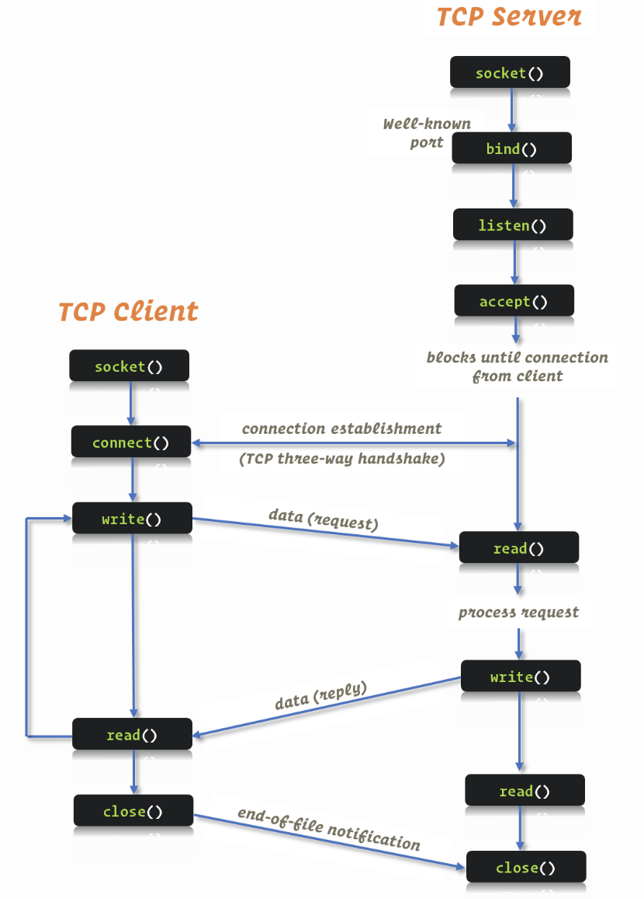

# Assignment

---

  

1.
    - In this assignment, you have to use the sample codes to implement a TCP
    server that sorts an array of integers provided by the clients. 
    - Modify the client code such that it can input an array
    of integers to the server. 
    - Initially, develop an iterative version of this sorting server, which
    accepts the requests as an array of integers from the clients one-by-one
    and outputs back the sorted array. Increase the number of clients from 1 to 4. 
    - For each client request and response,
    measure the system time elapsed from the request submitted,
    and the result returned, and also
    find out the average CPU utilization. 

    - Next, you need to develop a concurrent sorting server that handles
    multiple simultaneous requests from four different clients. 
    - Measure the response time of the concurrent server at each
    client end and also the server’s average CPU utilization. 
    - What is your observation regarding the response time and CPU cycles engaged? 
    - Plot (using bar plot) the response times at each
    client under the iterative and concurrent scenarios. 
    - Also, plot the CPU utilization at each server type. 

2.
   - The objective of this programming assignment is to make use of the sample
   codes and implement an online vocabulary service on two concurrent TCP servers.  
   - These servers take words as input from four clients at the same time and
     respond with the corresponding antonyms. E.g., if the client gives as input
     “top,” the server responds with “bottom.” If the input word is not present,
     the server should return an error message “Sorry, antonym not found.”  

   - You need to maintain a lookup table at the server side
   (implementation of the lookup table is your choice), which contains a list
   of predefined words and the corresponding antonyms. The first server searches
   the input word in the lookup table row-by-row and gives back the result
   (i.e., either the antonym or the error message). The second server should
   alphabetically sort the lookup table according to the words as a pre-processing,
   perform a binary search, and returns the result. Measure the response times
   from both the concurrent servers and write your observations regarding
   their performances.  
