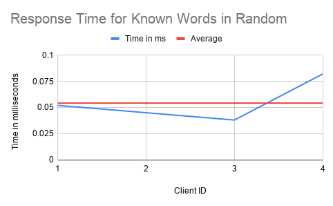
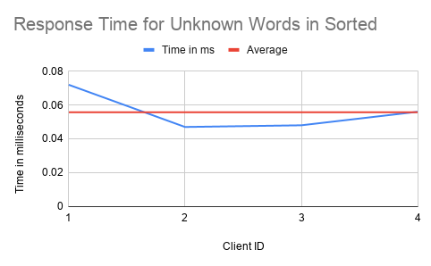

# Assignment 5

---

## Group Members

Anjishnu Mukherjee (B05-511017020 / 510517086)  
Souparno Bhattacharyya (B05-510417020/ 510517080)  
Kaustav Paul (510517006)  

---

We generate 100 random integers between -100 and 100, both inclusive,
from the random integer generator [here](https://www.random.org),because it
generates randomness based off atmospheric noise, which gives more randomness
than the pseduo-random integers genrated in C++ or Python random number
generation engines. We will be sampling from this set 5 numbers at a time to
provide as client input for the first problem.

## Problem 1

  We will be connecting 4 clients to a server.
  First, consider the case of the iterative server.
  The CPU usage on the server side is printed in the format
  of (us/sy/id) as printed in the information displayed by iostat.
  The time on the client side is printed in milliseconds.
  Each row corresponds to one client.

  | Iterative Server | Client |
  | :------:         | :----: |
  | 1/1/97           | 0.06   |
  | 1/1/97           | 0.05   |
  | 1/1/97           | 0.049  |
  | 1/1/97           | 0.064  |

  
  

  | Concurrent Server | Client |
  | :----: | :----: |
  | 1/1/97 | 0.053   |
  | 1/1/97 | 0.040   |
  | 1/1/97 | 0.109  |
  | 1/1/97 | 0.046  |

  
  

## Problem 2

  The CPU usage on the server side is printed in the format
  of (us/sy/id) as printed in the information displayed by iostat
  remains (1/1/97) across all experiments.

### Dictionary

  | Word | Antonym|
  | :--: | :---:  |
  |above  | below |
  |accept | rejec |
  |easy   | hard  |
  |enter  | exit  |
  |healthy| sick  |
  |hot    | cold  |
  |left   | right |
  |success|failur |
  |summer |winter |
  |up     | down  |

### Experiment 1

  We will run one client on the server multiple times. For each run, we will
  test for the words in the dictionary and we will also run for 5 times for
  words not in the dictionary. So, there will be a total of 15 runs for this
  experiment. The response time noted on the client side are listed below, with
  the first ten denoting words in the dictionary and the next 5 denoting words
  not in dictionary. The times are noted in milliseconds.

  The row of results below are for the random server.

  0.065, 0.07, 0.065, 0.058, 0.056, 0.068, 0.068, 0.051, 0.067, 0.051, 0.049,
  0.075, 0.065, 0.068, 0.059

  
  
  
  

  The row of results below are for the sorted server.

  0.065, 0.073, 0.063, 0.066, 0.066, 0.065, 0.069, 0.050, 0.056, 0.068, 0.067,
  0.062, 0.073, 0.050, 0.075

  
  

  
  

### Experiment 2

  We run 4 clients simulataneously and measure the time taken for 2 cases. One,
  for a word in the dictionary(known word) and two, for a word not in the
  dictionary (unknown word).

  Random server, known word   : 0.052, 0.045, 0.038, 0.082  

  
  

  Random server, unknown word : 0.061, 0.055, 0.042, 0.078  

  
  

  Sorted server, known word   : 0.072, 0.047, 0.048, 0.056  

  
  

  Sorted server, unknown word : 0.062, 0.072, 0.054, 0.042  

  
  

---

## Conclusions

The average response time for client side is nearly 0.06 ms across all
experiments, with some minor variations for the different types of servers.
The CPU usage also retains a nearly uniformly constant value across
all the experiments.
